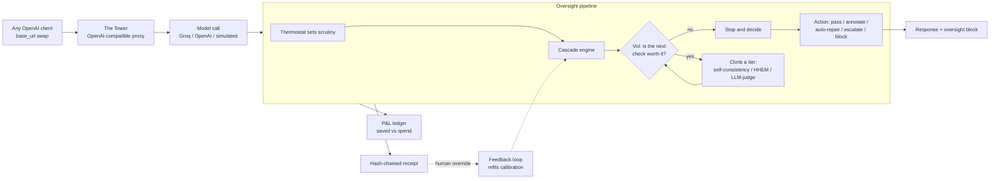

# ControlPlane

**Real-time oversight for enterprise AI, run as one economic decision.**

Enterprises run generative AI across many use cases at once, and every response carries three coupled risks:
it can be **wrong**, it can be **needlessly expensive**, and it can be **unsafe** (biased, leaking data, or
non-compliant). Today those are handled by separate tools, after the fact, with separate verdicts.

ControlPlane collapses them into a single decision. For every model response it asks: *how much is it worth to
verify this one?* It buys the cheapest check that could actually change the outcome, skips checks that cannot,
and lets the money saved on the cost axis help pay for the safety checks. One layer, three axes, one verdict,
with a tamper-evident receipt behind every call.

> Performance (is it wrong, or confidently wrong?) · Cost (is this the cheapest path to this quality?) ·
> Responsibility (is it biased, unsafe, or leaking data?)

Point any OpenAI client at it with a one-line `base_url` swap. Runs fully offline on a laptop with no keys, or
against a real model (Groq / OpenAI / local Ollama) when a key is set.

---

## What makes it different

Most parts here are commodities any competent team can assemble (LLM-as-judge, PII detection, model routing,
audit logging). The differentiation is the **control mechanism** that ties them together:

1. **Value-of-Information (VoI) gated oversight.** Per response, the engine computes the expected reduction in
   loss a check would buy versus its own cost and latency, and only then decides to run it. Checks are
   genuinely skipped or bought per input. This is adaptive oversight as a decision process, not a fixed pipeline.
2. **A statistical guarantee, not just a score.** Conformal risk control certifies a finite-sample bound on the
   escaped-failure rate (missed failures ≤ α) on labelled data. No listed competitor productizes a guarantee.
3. **Self-funding oversight.** Savings from routing simple prompts to cheaper models and serving repeats from
   cache offset the safety spend, so safety stops being a pure cost centre.

## How it works



A request hits **The Tower** (the OpenAI-compatible gateway). A **thermostat** sets a scrutiny level. The
**cascade engine** runs cheap T0 heuristics on every axis, then consults the **VoI rule** for each heavier
check and climbs only when it is worth buying. Per-axis calibrated probabilities combine into one verdict; the
**decision layer** picks an action, with a **streaming mid-stream abort** that stops a leak before the tokens
leave. The **P&L ledger** books cost saved vs safety spent; a **hash-chained receipt** records the full
value-of-information trace. A human override on any receipt feeds the **feedback loop**, which refits detector
calibration live.

## What is real, and what is measured

> Status: **working prototype, 152 tests, lint-clean, offline-first.**

- **VoI gating is real control.** Checks are genuinely skipped or run per input; the receipt trace shows
  RAN/SKIP with the VoI-vs-cost numbers, and flipping the policy changes which checks run.
- **The proxy is real.** Live `/v1/chat/completions` (streaming and non-streaming); a one-line `base_url` swap
  is all a client changes.
- **Measured economics on the real model path.** With a Groq key, benign and arbitrary traffic runs on a real
  model with measured token usage and cost, real route-down, and a real cache bypass. The planted risk
  scenarios stay scripted so the guardrail demos fire reliably. Per-request economics are projected to the
  brief's reference volume so the P&L is a meaningful figure, not a per-demo penny.
- **Detection lift is measured on real data.** On HaluEval, a lexical groundedness check scores F1 ~0.30; the
  VoI cascade climbing to **HHEM-2.1** only on the uncertain tail reaches F1 ~0.76, while roughly half of
  traffic clears free at T0. See [docs/EVIDENCE.md](docs/EVIDENCE.md).
- **Live probabilities are calibrated.** A Platt calibrator fitted offline on HaluEval (prior-corrected to a
  realistic deployment base rate) is loaded at startup, so the VoI thresholds and the conformal guarantee run
  on calibrated probabilities rather than raw detector scores.
- **The feedback loop is live.** A thumbs up/down on any receipt records a labelled override; once a detector
  has enough feedback its calibrator refits and hot-swaps into the running engine.
- **Everything is auditable.** Every decision is a SHA-256 hash-chained receipt with a verify endpoint and
  durable SQLite persistence.

We state boundaries plainly: by default the demo upstream is simulated and the dollar economics are estimated
on the *mechanism*; with a Groq key the real path makes them measured. The agent trajectory is scripted (the
auditor logic is real). See [docs/EVIDENCE.md](docs/EVIDENCE.md) for every number's source.

## Run it

```bash
make install         # creates .venv and installs the core engine + dev tools
make test            # unit tests for the VoI math, calibration, P&L, replay, and the proxy
make demo            # runs sample requests through the cascade and prints receipts + a P&L summary
make whatif          # re-runs a workload under strict/balanced/lenient/off (the risk-vs-cost frontier)
```

**See the whole product live (The Tower + Control-Tower dashboard):**

```bash
make install-serve   # adds the proxy deps (FastAPI, uvicorn, httpx)
make web-build       # (needs Node) builds the Next.js UI, served by FastAPI as ONE service
make serve           # starts The Tower on http://127.0.0.1:8000, open it in a browser
```

Open **http://127.0.0.1:8000**, click **Launch dashboard**, sign in (or use the seeded demo account / continue
as guest), and start in the **Playground**: type any prompt and watch a real model answer while ControlPlane
oversees it live. The dashboard has views for the live feed, the confidently-wrong map, the self-funding P&L
with an enterprise projection, the VoI skip-vs-buy contrast, the public benchmark results (Fixed HHEM vs
ControlPlane on HaluEval), a latency and scale benchmark, the risk guarantee, What-If replay, the StreamGuard
mid-stream abort, agent oversight, the compliance pack, and a drop-in API / integration guide.

**Multi-tenant by design.** Sign-up / login is built in, and each **workspace** (support bot, internal copilot,
agentic ops, …) is fully isolated: its own policies, hash-chained audit log, and oversight P&L never bleed
across use cases. Switch workspaces from the header; a seeded demo account lets judges log in instantly.

**Turn on the real model and the extras (all optional):**

```bash
echo 'GROQ_API_KEY=your_free_groq_key' >> .env    # measured economics + a real Playground model
pip install -e ".[ml]"                             # HHEM-2.1 groundedness + Presidio PII
pip install sentence-transformers                  # real embedding semantic cache
export CONTROLPLANE_SEMANTIC_CACHE=1               # enable near-duplicate cache bypass
```

`GET /healthz` shows what is live. For UI hot-reload during development, use `make web-dev` (UI on :3000).

**Reproduce the evidence:**

```bash
pip install -e ".[eval]"                           # the datasets library
make eval-real                                      # ControlPlane vs baselines on real HaluEval
make eval-real ARGS="--models"                      # same, with HHEM-2.1 on the uncertain tail
python -m controlplane.cascade.calibrate_live       # refit the live calibrator on HaluEval
```

Step-by-step test of every flow: [docs/TESTING.md](docs/TESTING.md).

## Repository layout

```
controlplane/         # the Python package
  core/               # shared contracts: types, Detector interface, receipt schema
  cascade/            # VoI engine, calibration, tier orchestration, detectors, informativeness
  pnl/                # pricing table + Oversight P&L ledger
  recorder/           # receipt builder + hash-chained store (JSONL + durable SQLite)
  replay/             # What-If / Replay simulator (the proof engine)
  feedback/           # human override -> recalibrate learning loop
  eval/               # labelled failure-injection harness + real HaluEval loader + metrics
  agent/              # agentic trajectory oversight (per-step cascade + compounding/loop/waste checks)
  compliance/         # EU AI Act / ISO 42001 / NIST AI RMF evidence-pack generator
  proxy/              # The Tower: OpenAI-compatible gateway + oversight service + benchmark + dashboard
  demo/               # end-to-end runnable demos
web/                  # Next.js + TypeScript + Tailwind product frontend (served by FastAPI as one service)
tests/                # unit tests (152)
docs/                 # WALKTHROUGH (start here), ARCHITECTURE, DECISIONS, EVIDENCE, DEMO, DEPLOY
```

## Documentation

- [docs/WALKTHROUGH.md](docs/WALKTHROUGH.md) — start here: every component and the user flow, with diagrams.
- [docs/ARCHITECTURE.md](docs/ARCHITECTURE.md) — how the engine works, including the VoI derivation.
- [docs/EVIDENCE.md](docs/EVIDENCE.md) — every external claim, with its primary source.
- [docs/DECISIONS.md](docs/DECISIONS.md) — architecture decision records.

## Run on Windows (VS Code)

`make` is not installed on Windows by default, so run the commands directly; everything else is cross-platform.

1. Install **Python 3.11+** (tick "Add python.exe to PATH"), **Git**, and **VS Code** with the Python extension.
2. Clone the repo and open the folder in VS Code.
3. Create and activate a virtual environment:
   ```powershell
   python -m venv .venv
   .venv\Scripts\Activate.ps1
   ```
   If PowerShell blocks activation, run `Set-ExecutionPolicy -Scope CurrentUser -ExecutionPolicy RemoteSigned`
   once, then activate again (or use `.venv\Scripts\activate.bat` in Command Prompt).
4. Install and run:
   ```powershell
   python -m pip install --upgrade pip
   pip install -e ".[dev]"
   pytest
   python -m controlplane.demo.run_demo
   ```

## License

MIT, see [LICENSE](LICENSE).
