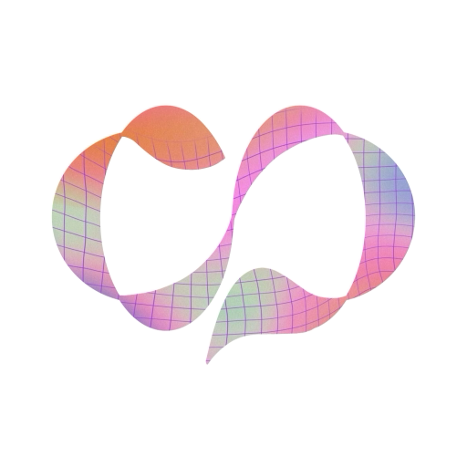
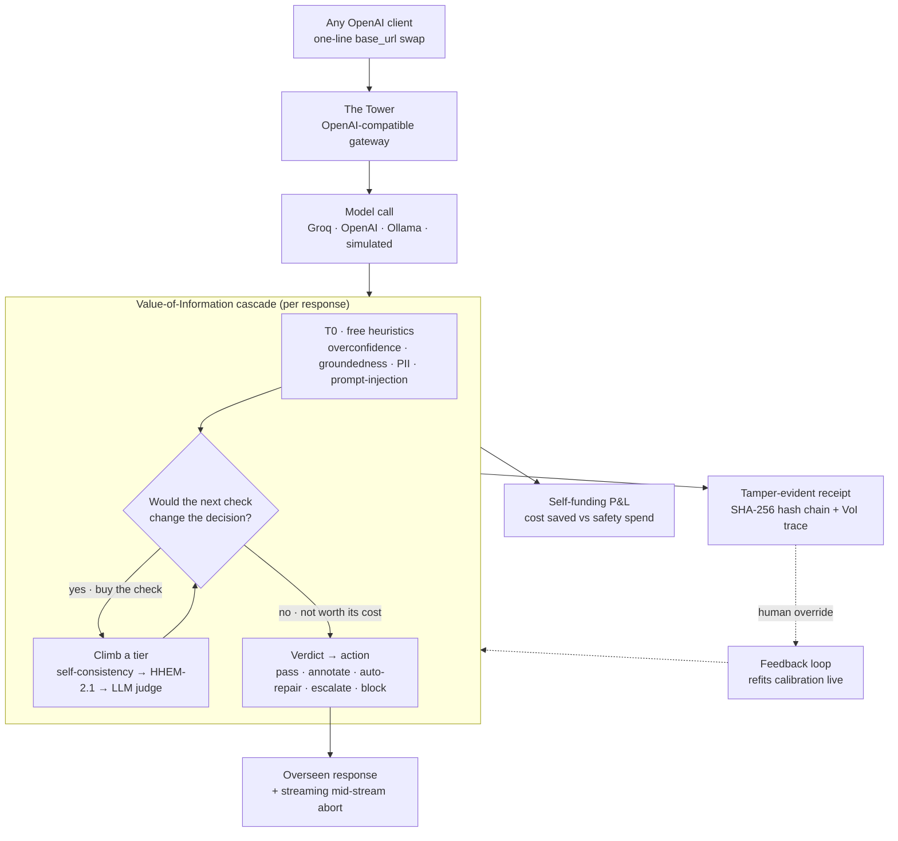

<p align="center">
  
</p>

<h1 align="center">ControlPlane · The Tower</h1>

<p align="center"><b>Real-time oversight for enterprise AI — run as one economic decision.</b></p>

<p align="center">
  <b>152 tests passing</b> · <b>offline-first</b> · <b>OpenAI-compatible gateway</b> · <b>multi-tenant</b> · MIT
</p>

---

Enterprises run generative AI across many use cases at once, and every response carries three coupled risks: it
can be **wrong**, it can be **needlessly expensive**, and it can be **unsafe** (biased, leaking data, or
non-compliant). Today those are handled by separate tools, after the fact, with separate verdicts.

**ControlPlane collapses them into a single decision.** It sits in front of any model as a drop-in gateway, and
for every response it asks one question: *how much is it worth to verify this one?* It buys the cheapest check
that could actually change the outcome, skips the checks that cannot, and lets the money saved on the cost axis
pay for the safety checks — so oversight becomes an asset, not a tax.

> **Performance** (is it wrong, or confidently wrong?) · **Cost** (is this the cheapest path to this quality?) ·
> **Responsibility** (is it biased, unsafe, or leaking data?) — one layer, three coupled axes, one verdict, with
> a tamper-evident receipt behind every call.

Point any OpenAI client at it with a one-line `base_url` swap. It runs fully offline on a laptop with no keys,
and lights up a real model (Groq / OpenAI / local Ollama) the moment a key is set.

## Why it stands out

The individual parts are commodities any capable team can assemble (LLM-as-judge, PII detection, model routing,
audit logging). Our edge is the **control mechanism** that turns them into one adaptive, economically-honest system:

1. **Value-of-Information (VoI) gated oversight.** Per response, the engine computes the expected reduction in
   loss a check would buy versus its own dollar-and-latency cost, and *only then* decides to run it. Checks are
   genuinely bought or skipped per input — adaptive oversight as a decision process, not a fixed pipeline.
2. **A statistical guarantee, not just a score.** Conformal risk control certifies a finite-sample bound on the
   escaped-failure rate (missed failures ≤ α) on labelled data. It doesn't just *score* risk — it *controls* it.
3. **Self-funding oversight.** Savings from routing simple prompts to smaller models and serving repeats from
   cache offset the safety spend, so the oversight ledger can run net-negative: safer **and** cheaper.
4. **Production-shaped.** Multi-tenant workspaces with real auth, hash-chained audit, streaming mid-stream abort,
   agentic oversight, a compliance pack, and a live human-feedback loop — not a notebook, a product.

## Highlights

- **The Tower** — an OpenAI-compatible gateway; every response is overseen inline, streaming included.
- **VoI cascade** — free heuristics (T0) → cheap models (self-consistency, HHEM-2.1) → an LLM judge, each tier
  bought only when the value beats the cost.
- **Public benchmark evidence** — Fixed-HHEM vs ControlPlane on real HaluEval, loaded live from your own run.
- **Risk guarantee** — conformal certificate on the escaped-failure rate.
- **Self-funding P&L** — an itemised ledger of savings (route-down · cache · early-abort) vs safety spend.
- **StreamGuard** — predicts and aborts a PII leak mid-stream, before the tokens leave.
- **Agentic oversight** — watches a multi-step agent, catches a compounding hallucination and its loop, aborts.
- **Multi-tenant** — sign-up / login and fully isolated workspaces per use case (policies, audit, P&L).
- **Compliance pack** — every decision mapped to EU AI Act / ISO 42001 / NIST AI RMF, exportable.
- **Live feedback loop** — a thumbs-up/down on any receipt refits detector calibration on the fly.

## How it works



A request hits **The Tower**. A **thermostat** sets a scrutiny level from recent risk. The **cascade engine**
runs cheap T0 heuristics on every axis, then consults the **VoI rule** for each heavier check and climbs a tier
only when it is worth buying. Per-axis calibrated probabilities combine into one verdict; the **decision layer**
picks an action, with a **streaming mid-stream abort** that stops a leak before the tokens leave. The **P&L
ledger** books cost saved vs safety spent; a **hash-chained receipt** records the full value-of-information
trace. A human override on any receipt feeds the **feedback loop**, which refits detector calibration live.

## What's real, and reproducible

> **Working product · 152 tests · lint-clean · offline-first.** Nothing below is a mock.

- **VoI gating is real control.** Checks are genuinely bought or skipped per input; the receipt trace shows
  RAN/SKIP with the VoI-vs-cost numbers, and switching the policy changes which checks run.
- **The gateway is real.** Live `/v1/chat/completions`, streaming and non-streaming — a one-line `base_url` swap
  is all a client changes.
- **Detection lift is measured on real data.** On HaluEval (500 labelled examples), gating **HHEM-2.1** with the
  VoI rule reaches **F1 0.80 at the same recall (0.70)** as running HHEM on everything (F1 0.76), with a much
  lower false-positive rate (**0.05 vs 0.15**) while buying **~55% fewer expensive checks** (227 vs 500), and
  roughly **half of traffic clears free at T0**. Reproduce it yourself with `make eval-aggregate`.
- **Economics are measured on the real path.** With a Groq key, real traffic runs on a real model with measured
  token usage and cost, real route-down, and a real cache bypass; the per-request result is projected to
  enterprise volume so the P&L is a meaningful figure. Prices are published provider list rates.
- **Probabilities are calibrated.** A Platt calibrator fitted offline on HaluEval (prior-corrected to a realistic
  base rate) loads at startup, so the VoI thresholds and the conformal guarantee run on calibrated probabilities.
- **The guarantee is real.** Conformal risk control certifies the escaped-failure bound on labelled data.
- **Everything is auditable.** Every decision is a SHA-256 hash-chained receipt with a verify endpoint and
  durable SQLite persistence.

We're precise about scope, because credibility is the point: the default upstream is a simulated
failure-injecting model (so the guardrail demos always fire), and a Groq key flips the same path to a real
model. The agent trajectory is a scripted scenario; the auditor that judges it is real.

## Quickstart

```bash
make install         # creates .venv and installs the core engine + dev tools
make test            # 152 unit tests: VoI math, calibration, P&L, replay, and the proxy
make demo            # runs sample requests through the cascade and prints receipts + a P&L summary
make whatif          # re-runs a workload under strict / balanced / lenient / off (the risk-vs-cost frontier)
```

**Run the whole product live (The Tower + the Control-Tower dashboard, one service):**

```bash
make install-serve   # adds the proxy deps (FastAPI, uvicorn, httpx)
make web-build       # (needs Node) builds the Next.js UI, served by FastAPI as ONE origin
make serve           # starts The Tower on http://127.0.0.1:8000
```

Open **http://127.0.0.1:8000**, click **Launch dashboard**, and either use the seeded demo account
(`demo@controlplane.ai` / `demo1234`), sign up, or continue as guest. Start in the **Playground**: type any
prompt and watch a real model answer while ControlPlane oversees it live.

**Turn on the real model and the optional extras (all opt-in):**

```bash
echo 'GROQ_API_KEY=your_free_groq_key' >> .env    # measured economics + a real Playground model
pip install -e ".[ml]"                             # HHEM-2.1 groundedness + Presidio PII
pip install -e ".[semantic-cache]"                 # real embedding semantic cache (pinned, HHEM-compatible)
export CONTROLPLANE_SEMANTIC_CACHE=1               # enable near-duplicate cache bypass
```

`GET /healthz` shows what is live. For UI hot-reload during development, use `make web-dev` (UI on :3000).

## Integrate in one line

```python
from openai import OpenAI

client = OpenAI(base_url="http://127.0.0.1:8000/v1", api_key="anything")
# every response now passes through the value-of-information cascade — streaming and tools still work
resp = client.chat.completions.create(
    model="openai/gpt-oss-20b",
    messages=[{"role": "user", "content": "What is the refund window?"}],
)
```

## The Control Tower (dashboard)

A judge can drive the whole system from the browser:

- **Set up** — *Playground* (a real model answered and overseen live) · *Use-case setup* (business facts →
  tuned policy, pre-filled from the active workspace).
- **Monitor** — *Overview*, *Live feed* (every signed receipt + its VoI trace), *Confidently-wrong* map,
  *Oversight P&L* (itemised self-funding breakdown).
- **Prove** — *VoI contrast* (skip-vs-buy on the same engine), *Public benchmarks* (Fixed-HHEM vs ControlPlane),
  *Risk guarantee*, *Latency & scale*, *Runtime health*, *What-If replay*, *StreamGuard*, *Agent oversight*.
- **Govern** — *Compliance* pack, *Detectors & models*, *API / Integration*.

## Multi-tenant by design

Login/signup is built in, and each **workspace** (support bot, internal copilot, agentic ops, …) is fully
isolated — its own policies, hash-chained audit log, and oversight P&L never bleed across use cases. Switch
workspaces from the header, or spin up a new one and tune its policy in a couple of clicks. The seeded demo
account lets judges log in instantly, and the deploy auto-generates a strong JWT secret.

## Reproduce the benchmarks

```bash
pip install -e ".[eval]"                                    # the datasets library
make eval-real                                               # ControlPlane vs baselines on real HaluEval
make eval-aggregate ARGS="--dataset halueval --limit 500"    # the head-to-head table (F1/FPR, latency, checks)
python -m controlplane.cascade.calibrate_live                # refit the live calibrator on HaluEval
```

`make eval-aggregate` writes `artifacts/aggregate_eval.json`, which the dashboard's **Public benchmarks** page
reads directly — the numbers on screen are the numbers from *your* run, never hardcoded.

## Repository layout

```
controlplane/         # the Python package
  core/               # shared contracts: types, Detector interface, receipt schema
  cascade/            # VoI engine, calibration, tier orchestration, detectors, informativeness
  pnl/                # pricing table + Oversight P&L ledger
  recorder/           # receipt builder + hash-chained store (JSONL + durable SQLite)
  replay/             # What-If / Replay simulator (the proof engine)
  feedback/           # human override -> recalibrate learning loop
  eval/               # labelled failure-injection harness + real HaluEval loader + metrics
  agent/              # agentic trajectory oversight (per-step cascade + compounding / loop / waste checks)
  compliance/         # EU AI Act / ISO 42001 / NIST AI RMF evidence-pack generator
  proxy/              # The Tower: OpenAI-compatible gateway, oversight service, auth + workspaces, benchmark
  demo/               # end-to-end runnable demos
web/                  # Next.js + TypeScript + Tailwind product frontend (served by FastAPI as one service)
tests/                # unit tests (152)
```

## Run on Windows (VS Code)

`make` is not installed on Windows by default, so run the commands directly; everything else is cross-platform.

1. Install **Python 3.11+** (tick "Add python.exe to PATH"), **Git**, and **VS Code** with the Python extension.
2. Clone the repo and open the folder in VS Code.
3. Create and activate a virtual environment:
   ```powershell
   python -m venv .venv
   .venv\Scripts\Activate.ps1
   ```
   If PowerShell blocks activation, run `Set-ExecutionPolicy -Scope CurrentUser -ExecutionPolicy RemoteSigned`
   once, then activate again (or use `.venv\Scripts\activate.bat` in Command Prompt).
4. Install and run:
   ```powershell
   python -m pip install --upgrade pip
   pip install -e ".[dev]"
   pytest
   python -m controlplane.demo.run_demo
   ```

## Acknowledgments

Built by **Team Hallucinators** for the **Accenture Innovation Challenge 2026**. Developed with AI
pair-programming assistance (Anthropic's **Claude Code**); all architecture, decisions, and results are the
team's own and independently reproducible from this repository.

## License

MIT — see [LICENSE](LICENSE).
